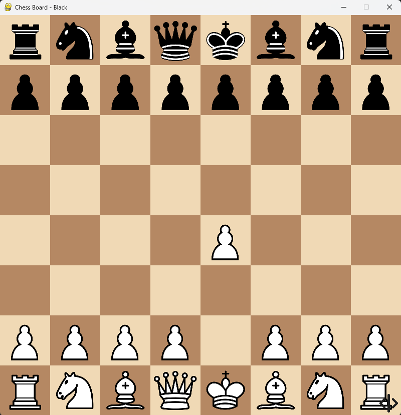
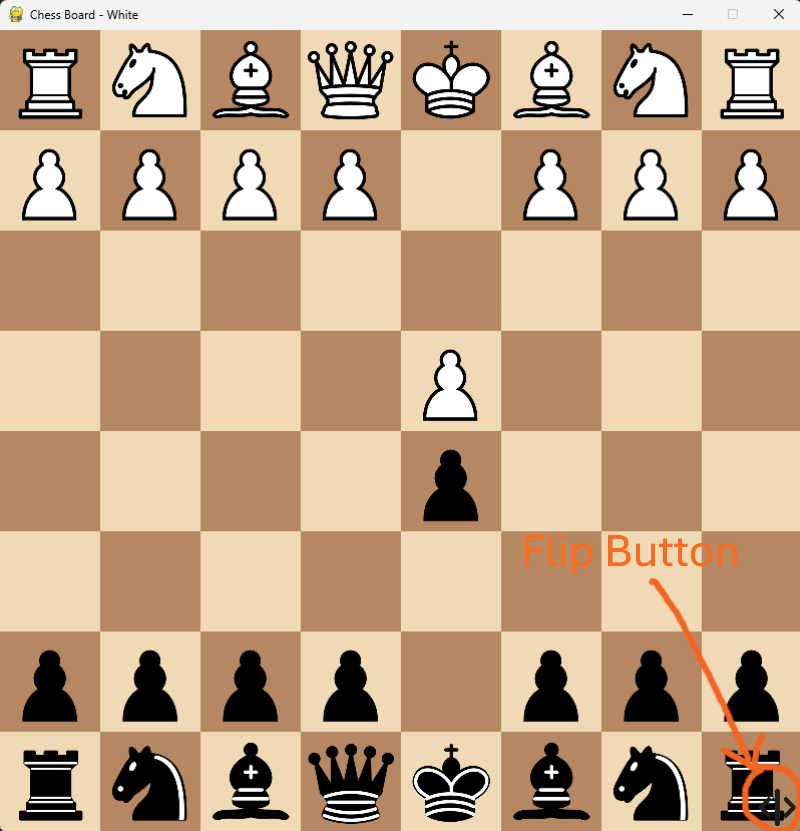
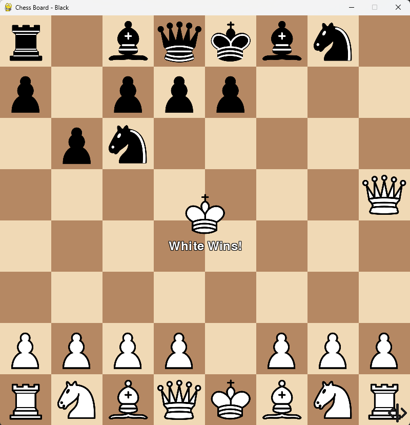
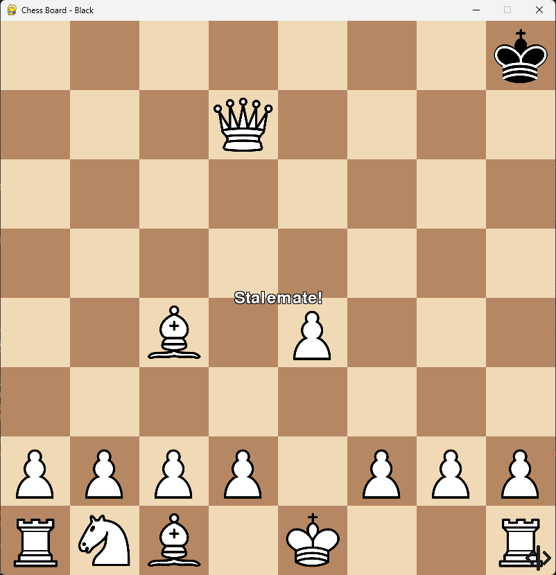

# The Chess Game 🎮♟  

A Python-based chess game with a graphical interface created using **Pygame**. This game supports local multiplayer, allowing two players to compete on the same system.  

---  

## Features ✨  
- **Local Multiplayer:** Two players can take turns on the same device.  
- **Complete Game Logic:** Includes piece movement, checks, stalemate and checkmate detection.  
- **Graphical UI:** Built using Pygame, providing a visually appealing chessboard and pieces.  
- **Room for Expansion:** Certain advanced rules like *en passant* and draw by repetition are not implemented yet, leaving space for future updates.  

---  

## Prerequisites 🛠  
Make sure you have the following installed:  

- **Python 3.7+**  
- **Pygame** library  

To install Pygame, run:  
```bash  
pip install pygame
```
## How to Run 🚀

1. Clone this repository to your local machine:  
   ```bash  
   git clone https://github.com/varunrajb1022/The-Chess-Game.git
   ```
2. Run the game using:
   ```bash
   python game_launcher.py
   ```
## Controls 🎮

- **Select Piece**: Click on the piece you want to move.
- **Move Piece**: Click on the destination square to move the selected piece.

## Features ✨

- **Local Multiplayer**: Play against a friend on the same machine.
- **Chess Piece Movement**: All pieces move according to the official chess rules.
- **Pawn Promotion**: When a pawn reaches the opposite side of the board, the player can promote it to a queen, rook, bishop, or knight via the user interface (UI).
- **Stalemate and Checkmate**: The game detects and displays stalemate and checkmate conditions.
- **Pygame-based UI**: The game is built using Pygame for the graphical interface.
- **Flip Button**: Board can be flipped when needed.

## Screenshots 📸

Below are some screenshots of the game's user interface:


*This is a screenshot of the chess board in play.*


*This shows how to flip the board.*


*This shows the checkmate state with pieces in place.*


*This shows the Pawn Promotion UI.*


*This shows the Stalemate state with pieces in place.*

## Missing Features ❌

- **En Passant**: Currently not supported.
- **Draw by Repetition**: Currently not supported.


